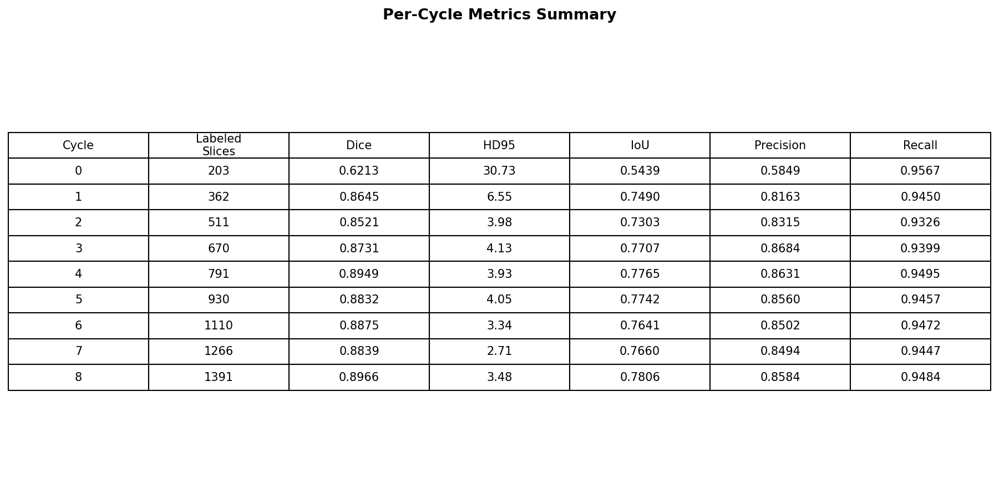
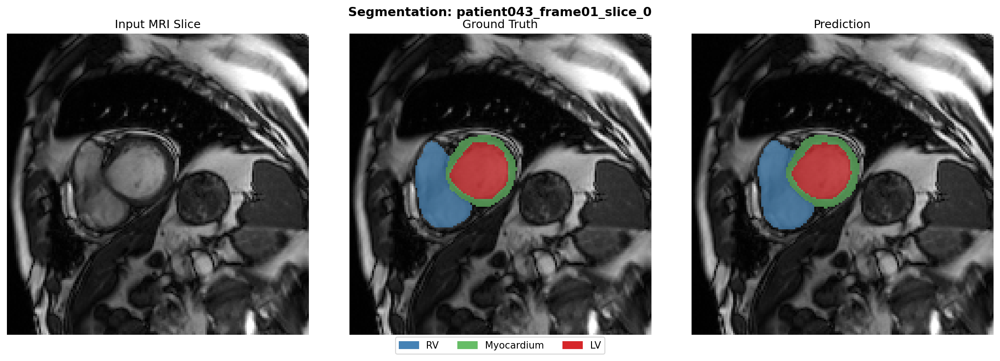

## Results

### Active Learning Performance

The table above summarizes the segmentation performance across multiple **active learning cycles**. As more informative MRI slices are selected and labeled, the model performance improves steadily.

Key observations:

- The number of labeled slices increases from **203 to 1321**.
- **Dice score** improves from **0.598 → 0.902**, indicating better segmentation overlap with the ground truth.
- **HD95** decreases significantly (**33.81 → 2.89**), showing more accurate boundary predictions.
- **IoU**, **precision**, and **recall** also improve as additional labeled samples are incorporated.

This demonstrates that **active learning can effectively improve model performance while gradually increasing labeled data**.

---

### Example Segmentation

Example segmentation results for a cardiac MRI slice:

- **Left:** Input MRI slice  
- **Middle:** Ground truth segmentation  
- **Right:** Model prediction  

Segmented cardiac structures:

- **RV (Right Ventricle)** – blue  
- **Myocardium** – green  
- **LV (Left Ventricle)** – red  

The prediction closely matches the ground truth, indicating that the model successfully identifies key cardiac structures.
